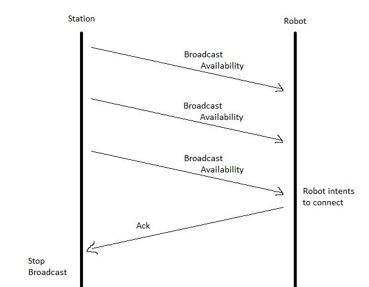
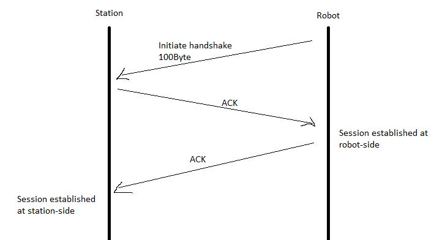
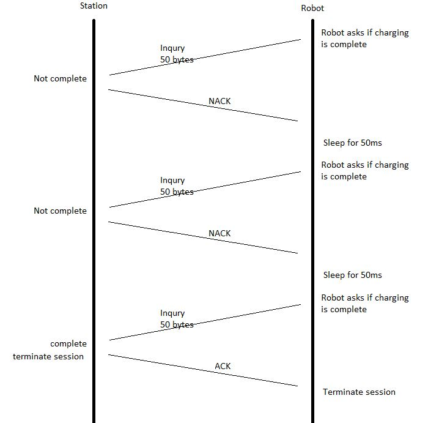

# Communication Design for Robot and Station

## Background
This project is a charging network that includes:
- multiple robots, which are equipped with RF MCU A moving around
- stations, which are equipped with RF MCU B staying on the ground.

The procedure steps are stated below.
1. Robot and Station have no info exchanged if no charging requested.
2. If charging is required, robots need to find the unoccupied station.
3. A robot moves to a station and tries to establish communication with it.
4. They exchange handshake message(payload 100 bytes) to confirm the session.
5. They must continuously exchange real-time messages (each with a payload of 50 bytes) at intervals of less than 100 ms until the session concludes.
6. Robot finishes the session and the Station becomes available again.

Note:
- RF modules use 802.15.4 as the basic communication standard.
- Multiple stations may be located only one meter away from each other.

## System Requirements
Specific requirements and constraints that the communication system between the robots (RF MCU A) and the stations (equipped with RF MCU B).

### Hardware Specifications
- Robots (RF MCU A): Equipped with RF modules supporting the 802.15.4 communication standard. Mobility of the robot is not covered in this document.
- Stations (RF MCU B): Stationary units equipped with RF modules that also support the 802.15.4 standard. A station could charge a robot one at a time.

### Communication Standards: LR-WPAN
Both robots and stations communicate via low-rate wireless personal area network (LR-WPAN) is a 802.15.4 Protocol.

### Data Exchange
- Handshake Message: Initiate session between a robot and a station. A handshake message with a payload of 100 bytes.
- Real-Time Messages: During the session, real-time messages with a payload of 50 bytes is exchanged.

### Timing Constraints
The interval for real-time message exchange should not exceed 100 milliseconds.

### Station Discovery
Available stations regularly broadcast their availability. The broadcast packet has each of the station's unique identity.
Assume that each of the station position is fixed.
Assume that the robot is able to scan the availability broadcast from the station.
Assume that the robot could move to the available station.

### Error Handling during session
The system could handle following errors: incomplete packet & timeout.

### Scalability
The design should able to easily new robots & stations.

## Communication Architecture
This architecture encompasses three key processes: (1) station discovery, (2) the handshake message exchange, and (3) the real-time messaging during sessions.
### station discovery

1. Station regularly broadcast that it is available.
2. When a robot receive a broadcast from an available station, the robot responds to that specific station, indicating its intent to charge.
3. Once a station receives a response from a robot, it ceases its broadcast.


### Handshake Message Exchange

1. Initial Contact: The robot initiates the handshake by sending a 100-byte payload to the station.
2. Station Acknowledgment (ACK): The station acknowledges the receipt of the robot's message by sending an ACK back to the robot.
3. Robot Acknowledgment: In turn, the robot sends an ACK to the station, confirming the establishment of a communication session.
4. Session Establishment: With this exchange of acknowledgments, a session is officially established, allowing the robot to proceed to the real-time messaging.

### Real-time messaging during sessions

1. Charging Status Inquiry: During the charging session, the robot sends a 50-byte payload to the station at regular intervals, inquiring whether charging is complete.
2. Station Response with NACK: The station responds with a Negative Acknowledgment (NACK) if charging is still in progress, prompting the robot to enter a sleep state briefly.
3. Repeat Process: The robot repeats this process, waking from sleep at specified intervals to send the inquiry again.
4. Charging Completion: Once charging is complete, the station responds with an ACK, indicating that the robot can terminate the session and the station becomes available for other robots.

## Data Structures f
### Data Structure for Station Discovery
Used by station (MCU B) to broadcast availability
Used by robot (MCU A) to scan information
```c
typedef struct {
    unsigned int stationID;  // Unique identifier for each station
    bool isAvailable;        // Availability status of the station
    // Additional fields can be added as needed (e.g., location, station's battery level)
} StationBroadcast_s;
```

### Data Structure for Handshake Message
Used by robot to initiate handshake process
Used by station to acknowledge it
```c
typedef struct {
    unsigned int robotID;    // Unique identifier for the robot
    unsigned int stationID;  // ID of the station the robot is trying to connect to
    char h_payload[100]; // Payload for the handshake, can include other necessary information
} HandshakeMessage_s;
```

### Data Structure for Real-Time Messages
Used by robot & station
```c
typedef struct {
    unsigned int sessionID; // Identifier for the ongoing charging session
    char r_payload[50]; // Payload for real-time communication, including a flag if charging is complete
} RealTimeMessage_s;
```

### Data Structure for Acknowledgement Messages
```c
typedef enum {
    ACK, // Acknowledgment
    NACK // Negative Acknowledgment
} Acknowledgment_s;
```